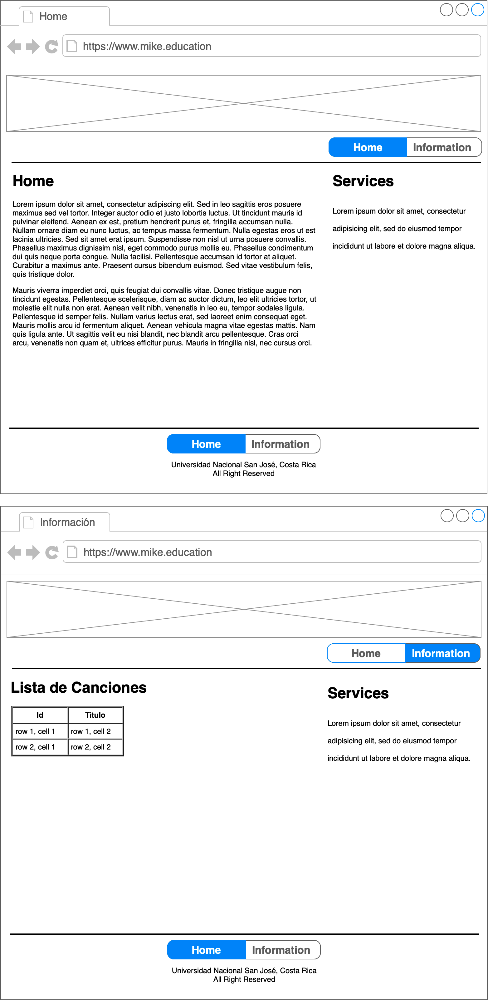

# Lab 4 - JS Web Frameworks

- Desarrollar el siguiente laboratorio utilizando framework o librerias de JS con ES6
- Webservice de la lista de canciones
  - https://jsonplaceholder.typicode.com/albums

## Mockup del Laboratorio

## Puntos a Evaluar

- JS Frameworks / Libraries
- Sitio web *Full responsive*
- ES6 estándar